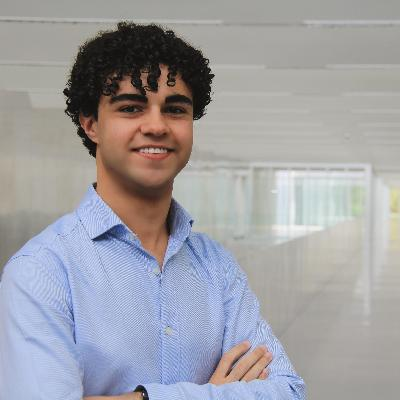

# Current PhD. students

 | Jon Justo Alvarez
--|:-------------------
 | [Erling Rennemo Jellum]{https://www.ntnu.no/ansatte/erling.r.jellum }
--|:-------------------
{: .tablelines}

# Current MSc. students
 | Michal Rowicki 
--|:-------------------
 | Armin Bahadoran
--|:-------------------
 | Aksel Gundersen
--|:-------------------
 | Yunus Emre Koc  
--|:-------------------
{: .tablelines}

# Older Students

### 2019-2020

Master students

| Joar Gjersund          |
| Mohamed Hassan Ismail  |
| Christoffer Boothby    |
| Max Montzka            |
| Marion Vrignaud        |
| Kristina Thue          |
{: .tablelines}

### 2018-2019

|Djordjije Boskovic| HSI target detection
|------------------|--------------------------------------------|
|Karine Avagian| RL deconcolution algorithm
|------------------|--------------------------------------------|
|Andreas Varntresk | Development of HSI camera control
|------------------|--------------------------------------------|
{: .tablelines}

### 2017-2018
Johan Fjeldtvedt | CCSDS.123 and CubeDMA
--|-------------------
Lars Bolstad | FPGA implementation of JPEG2000 
--|-------------------
Martin Haukali | Implementation of PCA for HSI applications
--|-------------------
Espen Moen | CCSDS.123 and CubeDMA
--|-------------------
Martin Haukali | Implementation of HSI Anomaly detection
--|-------------------
{: .tablelines}

